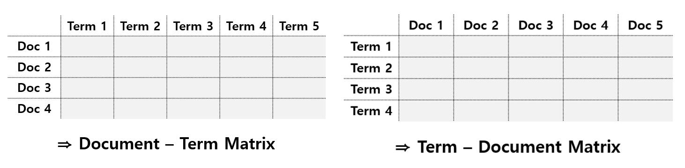
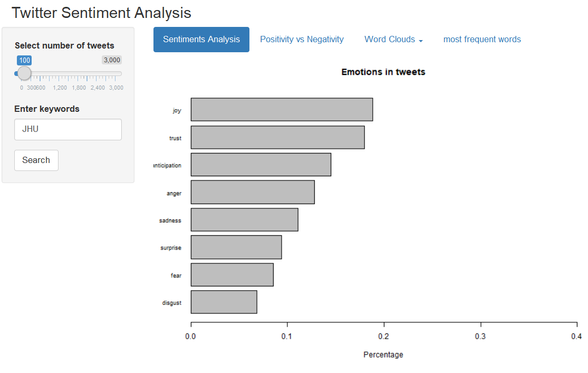
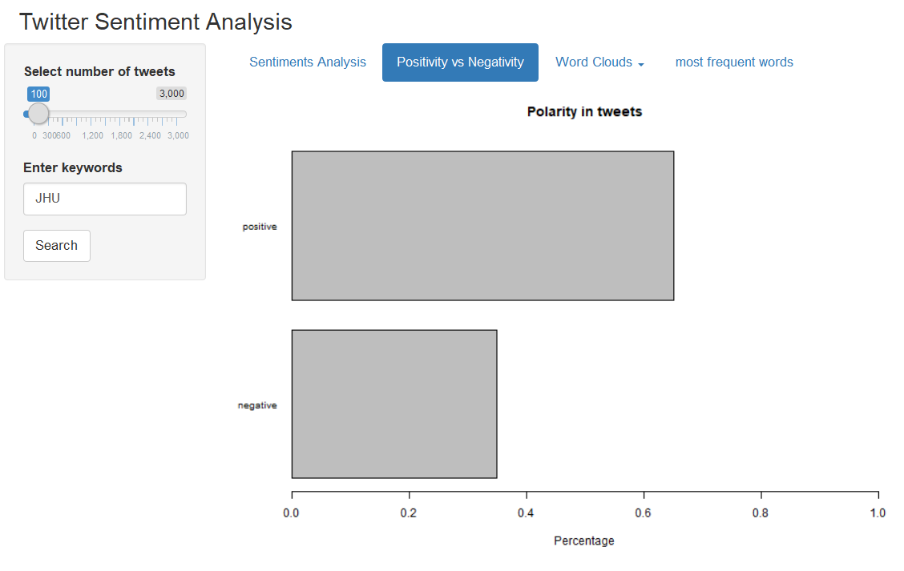
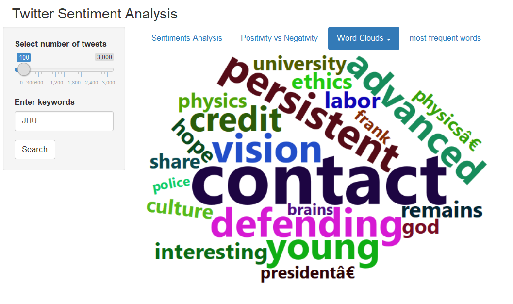
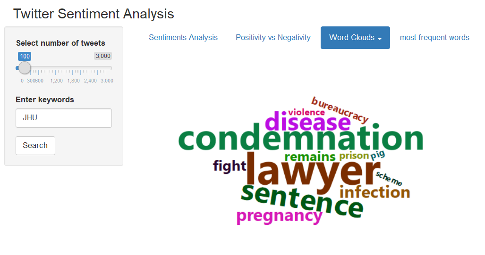
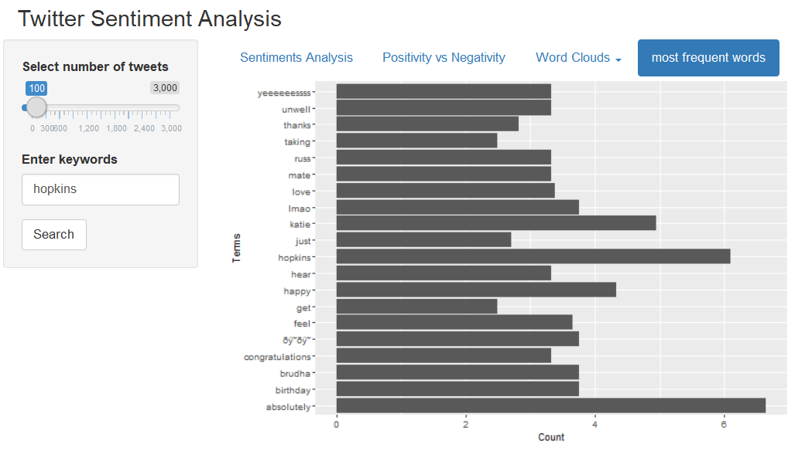

```{r setup, include=FALSE}
knitr::opts_chunk$set(echo = FALSE)
```

## Sentiment Analysis

Sentiment Analysis

- positive
- negative
- neutral

Twitter

- popular microblogging site
- A place to share personal views
- short text messages of 140 characters.

Application

- public response for products, events, ads, etc

```{r, echo=FALSE}
htmltools::img(src = knitr::image_uri(file.path('./twitter.png')), 
               alt = 'logo', 
               style = 'position:absolute; top:0; right:0; padding:10px;')
```


## Retrieve tweets and preprocessing

Retrieve tweets: Twitter authentication with OAuth:(package: twitteR)

Preprocessing/Text cleaning(function: gsub)

- Remove non-ASCII characters, punctuations, numbers, spaces, etc
- Remove stop words like the, a, and, etc(function: stopwords from tm)

Build Term Document Matrix/Document Term Matrix


```{r dtm, echo=FALSE, out.width = '100%'}

```

## Content

- search for a key word and set number of tweets
- Sentiment analysis: emotions
    * anger, anticipation, disgust, fear, joy, sadness, surprise, trust
- Polarity analysis: positivity vs negativity
    * positive, negative
- Word clouds
    * positive, negative
- most frequent words

## Demos
Sentiment analysis: emotions
<font size="3">(package: syuzhet)</font>
```{r page1, echo=FALSE, out.width = '100%'}

```

## Demos

Polarity analysis: positivity vs negativity
<font size="3">(package: syuzhet)</font>
```{r page2, echo=FALSE, out.width = '100%'}

```


## Demos
Word clouds-positive
<font size="3">(packages: wordcloud, wordcloud2, stringr)</font>
```{r page4, echo=FALSE, out.width = '100%'}

```

## Demos
Word clouds-negative
<font size="3">(packages: wordcloud, wordcloud2, stringr)</font>
```{r page5, echo=FALSE, out.width = '100%'}

```

## Demos
most frequent words

```{r page6, echo=FALSE, out.width = '100%'}

```


## Thank you!
